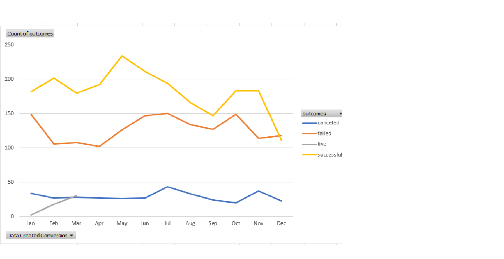

# FundRaisingAnalysis

# Kickstarting with Excel
When I first got the document I had to sort out the data 

## Overview of Project
The document was about Fund Raising 

### Purpose
The purpose was about fund raising and how much money they made of over time

## Analysis and Challenges
I had to get to count, and the sum of all the data and put them in a chart to make the data easy to read

### Analysis of Outcomes Based on Launch Date

It was very successful in raising money for lunch
### Analysis of Outcomes Based on Goals

They raised lots of money to there goal
### Challenges and Difficulties Encountered

The main thing I had problems was sorting out some of the data
## Results
The overall result was good and they raisied lots of money in there fund raising. 

